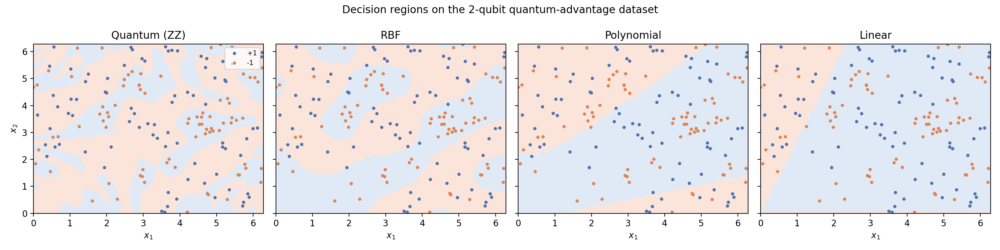
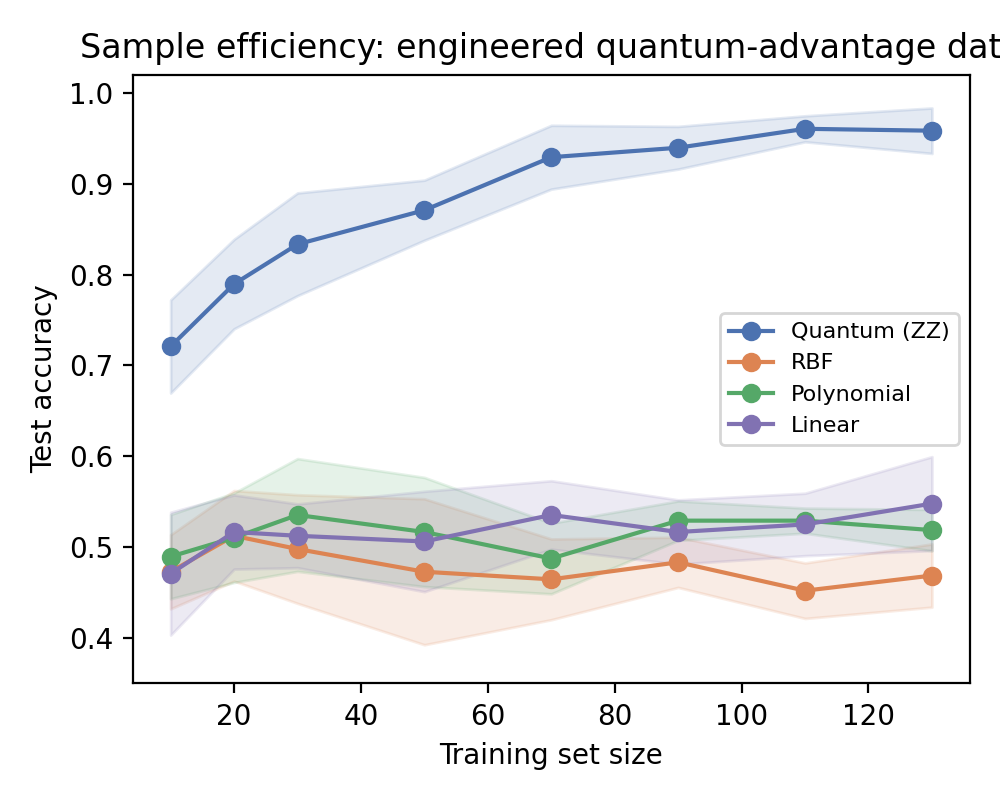
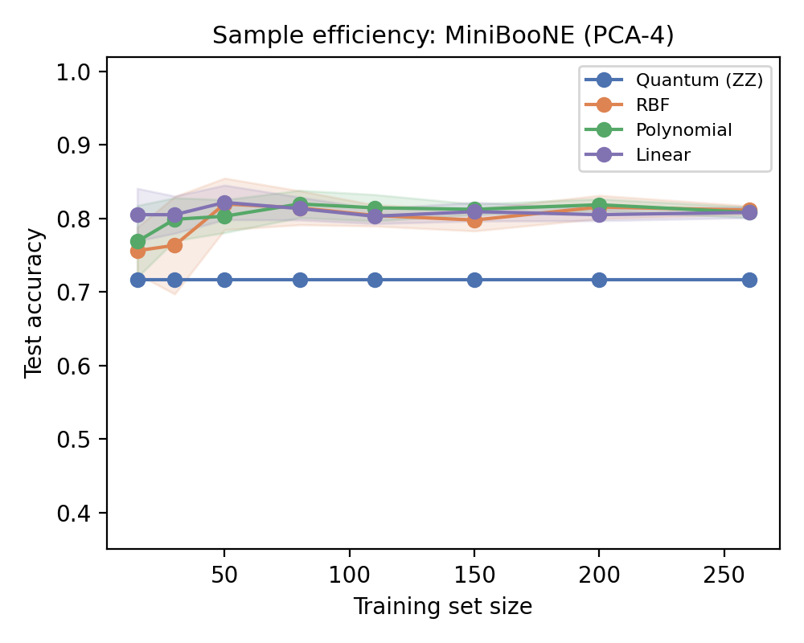

# When Do Quantum Kernels Help?

An empirical and diagnostic study of the Havlíček et al. (2019) ZZ feature-map
quantum kernel, implemented from scratch in NumPy (no quantum SDK) and
benchmarked against classical kernels (RBF, polynomial, linear) under one
shared model-selection protocol.

**Full write-up:** [`paper/main.pdf`](paper/main.pdf) (NeurIPS-format, double-blind)

## Key finding

The quantum kernel is not a general-purpose upgrade over classical kernels —
whether it helps depends entirely on whether the data's structure matches its
feature map.

| Dataset | Quantum (ZZ) | Best classical | Majority baseline |
|---|---|---|---|
| Synthetic, engineered to match the feature map (n=4) | **98.3%** | 48.3% | 50.0% |
| Synthetic, engineered to match the feature map (n=6) | **73.3%** | 53.3% | 50.0% |
| MiniBooNE particle identification (real physics data, PCA-4) | 71.7% | **81.7%** | 71.7% |
| MiniBooNE particle identification (real physics data, PCA-6) | 71.7% | **86.7%** | 71.7% |

On data engineered so its labels are a function of the same feature map, the
quantum kernel dominates every classical kernel. On real particle-physics
data (MiniBooNE, Fermilab) with no such engineered relationship, it collapses
exactly to the majority-class baseline at every qubit count tested, while
classical kernels reach 81–87%. We diagnose why using kernel-target alignment
and kernel-value concentration statistics — see the paper for the full
analysis.

### Decision regions on the 2-qubit engineered dataset

Only the quantum kernel's feature space matches how the labels were
generated; classical kernels with smoother inductive biases cannot resolve
the same (highly non-convex) true boundary:



### Sample efficiency




## Project structure

```
src/
  quantum_kernel.py        exact NumPy simulator of the ZZ feature-map fidelity kernel
  test_quantum_kernel.py   validates the simulator against an independent brute-force implementation
  synthetic_data.py        engineered "quantum-advantage" dataset generator
  datasets.py               MiniBooNE loader (PCA + [0, 2pi) scaling)
  kernels.py                classical kernels + normalization
  model_selection.py        shared CV / train / test protocol for all kernels
  run_experiments.py        main benchmark -> results/benchmark.json
  figures.py                learning curves + decision-boundary figure -> figures/
julia/
  QuantumKernel.jl          independent Julia reimplementation of the simulator (FWHT-based)
  test_quantum_kernel.jl    same sanity checks, ported to Julia
results/
  benchmark.json             raw accuracy / alignment numbers for every kernel and dataset
figures/                     PNGs used in the paper
paper/
  main.tex, references.bib   NeurIPS-format paper source
  main.pdf                   compiled paper
```

## Reproducing the results

Requires Python with `numpy`, `scipy`, `scikit-learn`, `matplotlib`.

```bash
cd src
python test_quantum_kernel.py   # sanity checks: unitarity, PSD kernel, brute-force cross-check
python run_experiments.py       # main benchmark -> ../results/benchmark.json
python figures.py               # -> ../figures/*.png
```

To recompile the paper (requires a LaTeX distribution, e.g. MiKTeX or TeX Live):

```bash
cd paper
pdflatex main.tex && bibtex main && pdflatex main.tex && pdflatex main.tex
```

## Method summary

- **Quantum kernel:** `k(x,x') = |<phi(x)|phi(x')>|^2` for the "full
  entanglement" ZZ feature map, simulated exactly (not sampled) via a batched
  Walsh–Hadamard transform + vectorized diagonal-phase update — no quantum
  library required, and fast enough (< 2s) to run every experiment in this
  repo on a laptop CPU. Independently reimplemented in Julia
  (`julia/QuantumKernel.jl`) using a different transform algorithm (in-place
  FWHT butterfly) and RNG; on 200 random 6-qubit inputs the two
  implementations' kernel matrices agree to within 5.6e-15 (machine
  precision).
- **Positive control:** synthetic datasets whose labels are the sign of a
  fixed observable measured in a Haar-random rotated basis of the same
  feature map, following Havlíček et al. (2019) — separable by the quantum
  kernel by construction.
- **Negative control:** MiniBooNE particle identification (UCI/OpenML), a
  real high-energy-physics benchmark with no relationship to the feature map.
- All kernels are normalized to unit diagonal and driven through the same
  cross-validated SVM protocol, so comparisons isolate the kernel choice.
